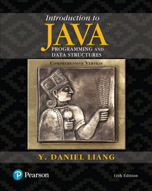

# JDBC examples from the book: Introduction to Java Programming, Eleventh Edition by Y. Daniel Liang

[](http://www.cs.armstrong.edu/liang/intro11e/)

**References:**
 
- [Introduction to Java Programming, 11th Edition by Y. Daniel Liang](http://www.cs.armstrong.edu/liang/intro11e/)
- [Examples organized by chapters](https://media.pearsoncmg.com/ph/esm/ecs_liang_ijp_11/cw/content/ExampleByChapters.html)
- [https://github.com/aJetHorn/Intro-to-Java-Programming-9E/tree/master/Supplements/Database%20Supplements](https://github.com/aJetHorn/Intro-to-Java-Programming-9E/tree/master/Supplements/Database%20Supplements)
- [How to run .SQL script using JDBC? by Nishtha Thakur](https://www.tutorialspoint.com/how-to-run-sql-script-using-jdbc)
  - You can execute .sql script files in Java using the runScript() method of the ScriptRunner class of Apache iBatis
  - [https://github.com/mybatis/mybatis-3](https://github.com/mybatis/mybatis-3)
 
## Create tables and insert rows:
 
**See resources folder** and check/modify the files:

- **mysql.properties**
- **oracle.properties**

**Review the code and run:**

- LoadMySQLScript.java
- LoadOracleScript.java
- RunSQLScript.java

## JDBC examples from Chapter 34: Java Database Programming

1. [SimpleJdbc](https://liveexample.pearsoncmg.com/liang/intro11e/html/SimpleJdbc.html)

2. [SimpleJdbcWithAutoClose](https://liveexample.pearsoncmg.com/liang/intro11e/html/SimpleJdbcWithAutoClose.html)

3. [FindGrade](https://liveexample.pearsoncmg.com/liang/intro11e/html/FindGrade.html): Accessing database from JavaFX, SQL Injection vulnerable

4. [FindGradeUsingPreparedStatement](https://liveexample.pearsoncmg.com/liang/intro11e/html/FindGradeUsingPreparedStatement.html)

5. [TestCallableStatement](https://liveexample.pearsoncmg.com/liang/intro11e/html/TestCallableStatement.html)
   
6. [TestDatabaseMetaData](https://liveexample.pearsoncmg.com/liang/intro11e/html/TestDatabaseMetaData.html)
  
7. [FindUserTables](https://liveexample.pearsoncmg.com/liang/intro11e/html/FindUserTables.html)

8. [TestResultSetMetaData](https://liveexample.pearsoncmg.com/liang/intro11e/html/TestResultSetMetaData.html)

## JDBC examples from Chapter 35: Advanced Java Database Programming

1. [SQLClient](https://liveexample.pearsoncmg.com/liang/intro11e/html/SQLClient.html)

2. [CopyFileToTable](https://liveexample.pearsoncmg.com/liang/intro11e/html/CopyFileToTable.html)

3. [ScrollUpdateResultSet](https://liveexample.pearsoncmg.com/liang/intro11e/html/ScrollUpdateResultSet.html)
    
4. [SimpleRowSet](https://liveexample.pearsoncmg.com/liang/intro11e/html/SimpleRowSet.html)

5. [RowSetPreparedStatement](https://liveexample.pearsoncmg.com/liang/intro11e/html/RowSetPreparedStatement.html)
    
6. [ScrollUpdateRowSet](https://liveexample.pearsoncmg.com/liang/intro11e/html/ScrollUpdateRowSet.html)

7. [TestRowSetEvent](https://liveexample.pearsoncmg.com/liang/intro11e/html/TestRowSetEvent.html)

8. [StoreAndRetrieveImage](https://liveexample.pearsoncmg.com/liang/intro11e/html/StoreAndRetrieveImage.html)

## ORACLE XE 11 G (Docker container)

- [Docker image: Oracle Express Edition 11g Release 2 on Ubuntu 18.04 LTS](https://hub.docker.com/r/oracleinanutshell/oracle-xe-11g)

```
docker pull oracleinanutshell/oracle-xe-11g
```

### Create a container oraclexe11g:

```
docker run --name oraclexe11g -d -p 49161:1521 -p 8383:8080 oracleinanutshell/oracle-xe-11g
```

**Connection data:**

```
hostname: localhost
    port: 49161
    sid: xe
    username: system
    password: oracle
```

**Container oraclexe11g shell:**

```
$ docker exec -it oraclexe11g bash
```

```
root@cca07f0f6f15:/# sqlplus

SQL*Plus: Release 11.2.0.2.0 Production on Thu May 11 15:08:06 2019

Copyright (c) 1982, 2011, Oracle.  All rights reserved.

Enter user-name: scott
Enter password: tiger

Connected to:
Oracle Database 11g Express Edition Release 11.2.0.2.0 - 64bit Production

SQL> 

SQL> select table_name from user_tables;
TABLE_NAME
------------------------------
DEPARTMENT
ENROLLMENT
TAUGHTBY
FACULTY
SUBJECT
COURSE
STUDENT
COLLEGE
CSCI4990
CSCI1301
CSCI1302

TABLE_NAME
------------------------------
CSCI3720
ACCOUNT
ADDRESS
COUNTRY
STUDENT1
STUDENT2

17 rows selected.

SQL> quit
Disconnected from Oracle Database 11g Express Edition Release 11.2.0.2.0 - 64bit Production
root@cca07f0f6f15:/# exit
exit
$
```