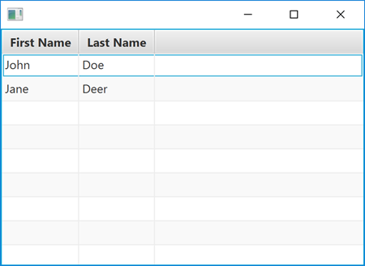
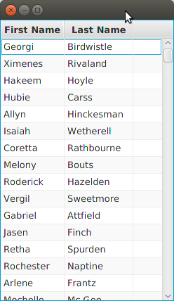
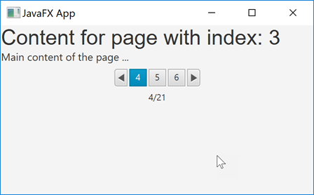
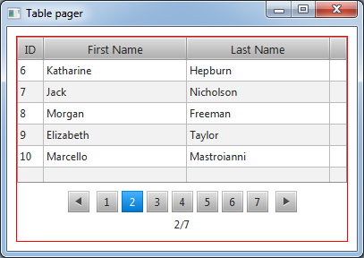
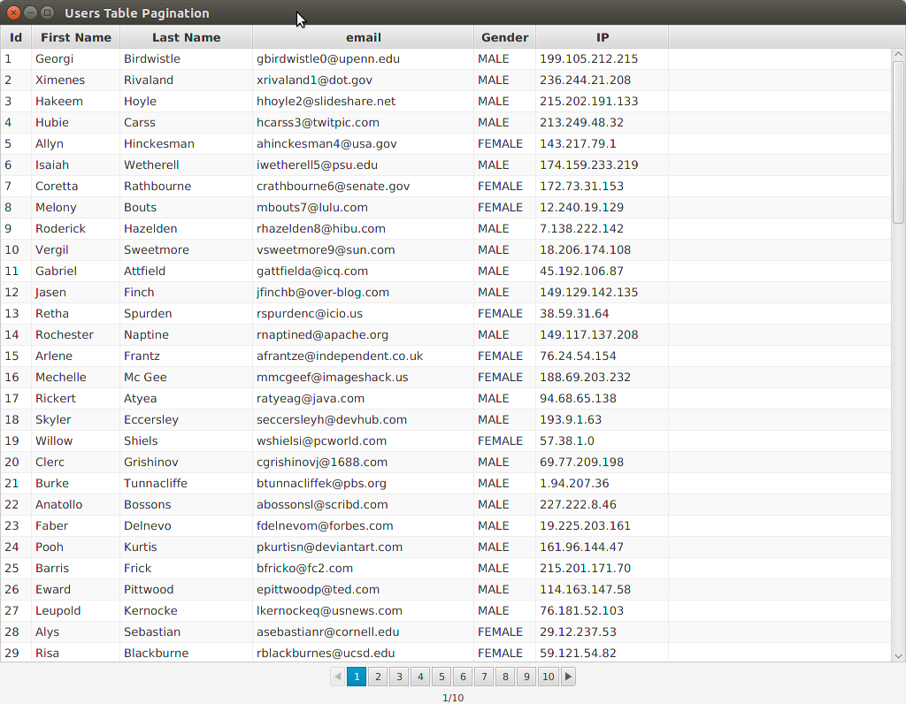

# JavaFX TableView examples

## [JavaFX TableView (http://tutorials.jenkov.com)](http://tutorials.jenkov.com/javafx/tableview.html)

 The JavaFX TableView enables you to display table views inside your JavaFX applications.
 
 The JavaFX TableView is represented by the class `javafx.scene.control.TableView`  
  
 See **TableViewExample.java**
  

## TableViewCSV.java

Same as `TableViewExample.java` but the column data come from a csv file.

`users.csv` test data from **[https://mockaroo.com/](https://mockaroo.com/)**

## [JavaFX Pagination](http://tutorials.jenkov.com/javafx/pagination.html)

See **PaginationExample.java**

## [JavaFX TableView Paginator](https://stackoverflow.com/questions/15349185/javafx-tableview-paginator)
 
See **TablePager.java** 

## UsersTablePagination.java 

Based on Based on [Tim Büthe code](https://gist.github.com/timbuethe/7becdc4556225e7c5b7b)

`users.csv` test data from **[https://mockaroo.com/](https://mockaroo.com/)**

