# [JavaFX tutorial](http://zetcode.com/gui/javafx/)

## [By Jan Bodnar, ZetCode.com](http://zetcode.com/)

This is a JavaFX tutorial. The JavaFX tutorial is suited for beginners and intermediate Java developers. After reading this tutorial, you will be able to develop non-trivial JavaFX applications.

## Table of contents

- [Introduction](http://zetcode.com/gui/javafx/intro/)
- [First programs](http://zetcode.com/gui/javafx/firstprograms/)
- [Layout panes](http://zetcode.com/gui/javafx/layoutpanes/)
- [JavaFX controls](http://zetcode.com/gui/javafx/controls/)
- [JavaFX controls II](http://zetcode.com/gui/javafx/controlsII/)
- [Events](http://zetcode.com/gui/javafx/events/)
- [Effects](http://zetcode.com/gui/javafx/effects/)
- [Animation](http://zetcode.com/gui/javafx/animation/)
- [Canvas](http://zetcode.com/gui/javafx/canvas/)
- [Charts](http://zetcode.com/gui/javafx/charts/)

## Screenshots

### [Introduction](http://zetcode.com/gui/javafx/intro/)

- [FirstEx.java](src/com/zetcode/introduction/e01/FirstEx.java)

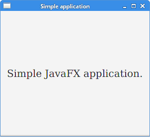

### [First programs](http://zetcode.com/gui/javafx/firstprograms/)

- [QuitButtonEx.java](src/com/zetcode/firstprograms/e02/QuitButtonEx.java)

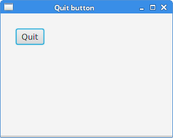

- [TooltipEx.java](src/com/zetcode/firstprograms/e03/TooltipEx.java)

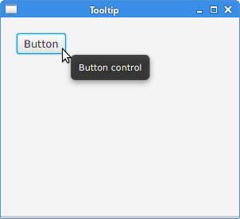

- [MnemonicEx.java](src/com/zetcode/firstprograms/e04/MnemonicEx.java)

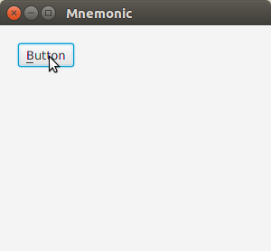

- [StylingTextEx.java](src/com/zetcode/firstprograms/e05/StylingTextEx.java)

### [Layout panes](http://zetcode.com/gui/javafx/layoutpanes/)

- [AbsoluteLayoutEx.java](src/com/zetcode/layout/e06/AbsoluteLayoutEx.java)

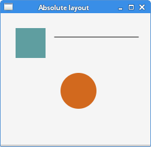

- [FlowPaneEx.java](src/com/zetcode/layout/e07/FlowPaneEx.java)

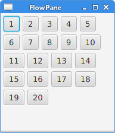

- [RowOfButtonsEx.java](src/com/zetcode/layout/e08/RowOfButtonsEx.java)

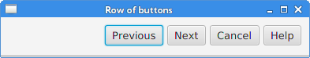

- [BorderPaneEx.java](src/com/zetcode/layout/e09/BorderPaneEx.java)

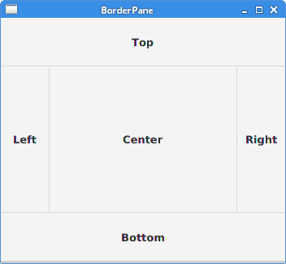

- [CornerButtonsEx.java](src/com/zetcode/layout/e10/CornerButtonsEx.java)

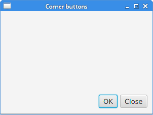

- [NewFolderEx.java](src/com/zetcode/layout/e11/NewFolderEx.java)

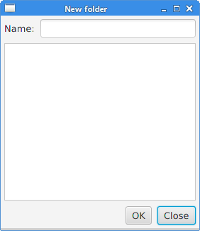

- [MigLayoutWindowsEx.java](src/com/zetcode/layout/e12/MigLayoutWindowsEx.java)

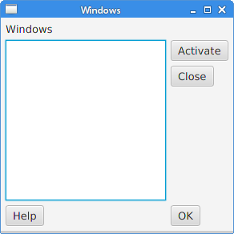

###  [JavaFX controls](http://zetcode.com/gui/javafx/controls/)

- [LabelEx.java](src/com/zetcode/controls1/e13/LabelEx.java)

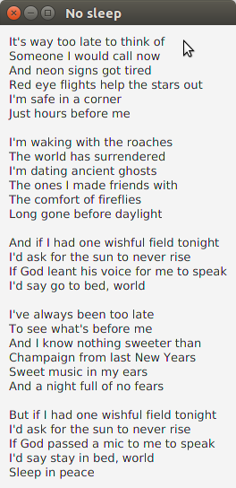

- [LabelForEx.java](src/com/zetcode/controls1/e14/LabelForEx.java)

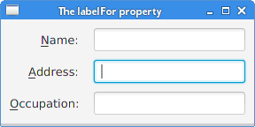

- [CheckBoxEx.java](src/com/zetcode/controls1/e15/CheckBoxEx.java)

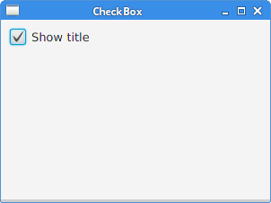

- [SliderEx.java](src/com/zetcode/controls1/e16/SliderEx.java)

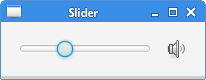

- [ChoiceBoxEx.java](src/com/zetcode/controls1/e17/ChoiceBoxEx.java)

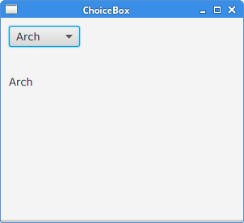

- [ProgressBarEx.java](src/com/zetcode/controls1/e18/ProgressBarEx.java)

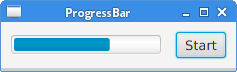

###  [JavaFX controls II](http://zetcode.com/gui/javafx/controlsII/)

- [DatePickerEx.java](src/com/zetcode/controls2/e19/DatePickerEx.java)

- [MenuBarEx.java](src/com/zetcode/controls2/e20/MenuBarEx.java)

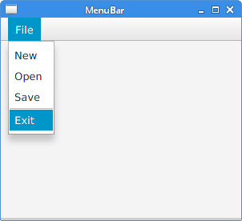

- [ColorPickerEx.java](src/com/zetcode/controls2/e21/ColorPickerEx.java)

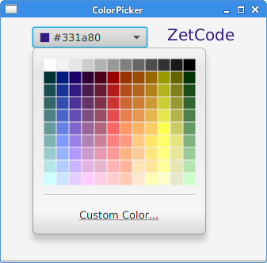

- [RadioButtonEx.java](src/com/zetcode/controls2/e22/RadioButtonEx.java)

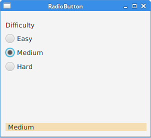

- [TabPaneEx.java](src/com/zetcode/controls2/e23/TabPaneEx.java)

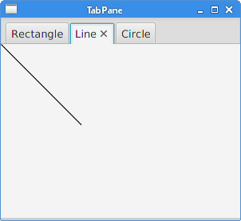

### [Events](http://zetcode.com/gui/javafx/events/)

- [EventHandlerEx.java](src/com/zetcode/events/e24/EventHandlerEx.java)

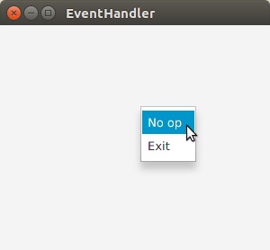

- [EventSourceEx.java](src/com/zetcode/events/e25/EventSourceEx.java)

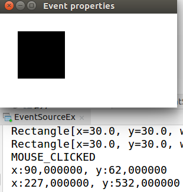

- [GenericHandlerEx.java](src/com/zetcode/events/e26/GenericHandlerEx.java)

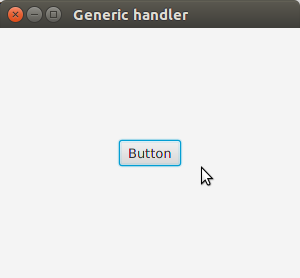

- [MultipleSourcesEx.java](src/com/zetcode/events/e27/MultipleSourcesEx.java)

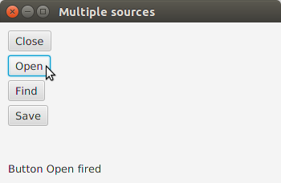

- [TimerEx.java](src/com/zetcode/events/e28/TimerEx.java)

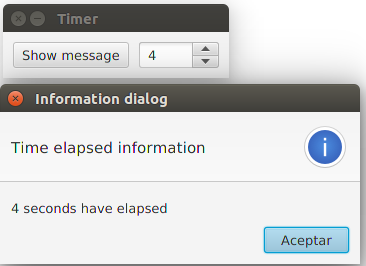

- [MovingWindowEx.java](src/com/zetcode/events/e29/MovingWindowEx.java)

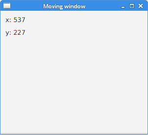

### [Effects](http://zetcode.com/gui/javafx/effects/)

- [DropShadowEx.java](src/com/zetcode/effects/e30/DropShadowEx.java)

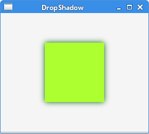

- [ReflectionEx.java](src/com/zetcode/effects/e31/ReflectionEx.java)

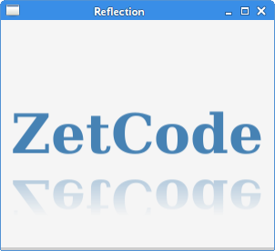

- [LightingEx.java](src/com/zetcode/effects/e32/LightingEx.java)

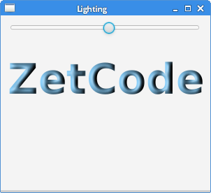

- [GaussianBlurEx.java](src/com/zetcode/effects/e33/GaussianBlurEx.java)

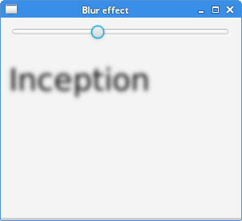

- [SepiaToneEx.java](src/com/zetcode/effects/e34/SepiaToneEx.java)

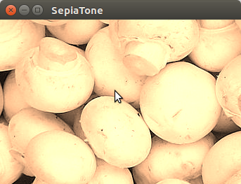

- [PerspectiveEx.java](src/com/zetcode/effects/e35/PerspectiveEx.java)

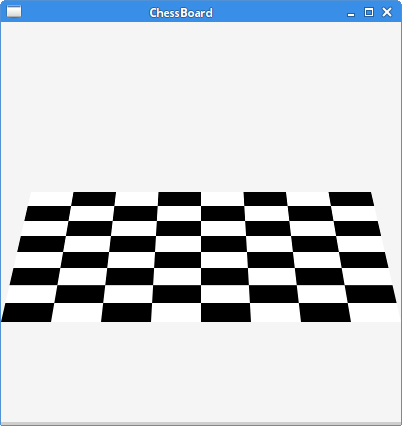

- [CombiningEffectsEx.java](src/com/zetcode/effects/e36/CombiningEffectsEx.java)

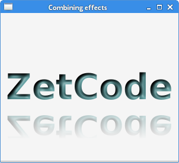

### [Animation](http://zetcode.com/gui/javafx/animation/)

- [AnimationTimerEx.java](src/com/zetcode/animation/e37/AnimationTimerEx.java)

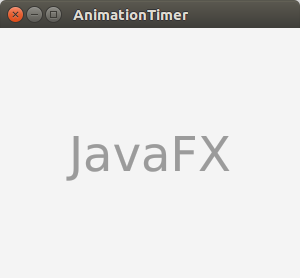

- [FadeTransitionEx.java](src/com/zetcode/animation/e38/FadeTransitionEx.java)

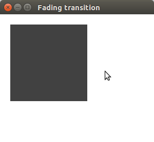

- [PathTransitionEx.java](src/com/zetcode/animation/e39/PathTransitionEx.java)

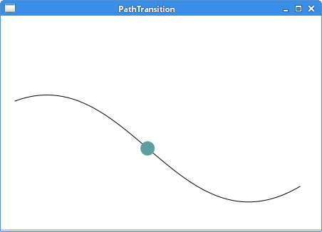

- [ParallelTransitionEx.java](src/com/zetcode/animation/e40/ParallelTransitionEx.java)

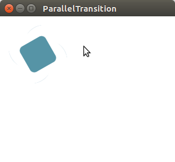

- [SequentialTransitionEx.java](src/com/zetcode/animation/e41/SequentialTransitionEx.java)

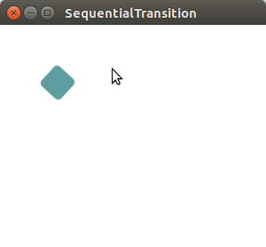

- [TimelineEx.java](src/com/zetcode/animation/e42/TimelineEx.java)

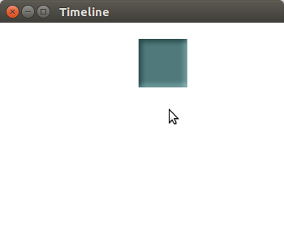

- [SequentialTimelineEx.java](src/com/zetcode/animation/e43/SequentialTimelineEx.java)

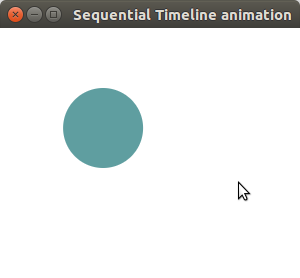

### [Canvas](http://zetcode.com/gui/javafx/canvas/)

- [SimpleLinesEx.java](src/com/zetcode/canvas/e44/SimpleLinesEx.java)

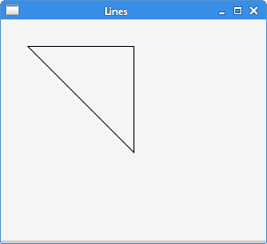

- [StrokeFillEx.java](src/com/zetcode/canvas/e45/StrokeFillEx.java)

- [ColoursEx.java](src/com/zetcode/canvas/e46/ColoursEx.java)

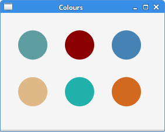

- [LinearGradientEx.java](src/com/zetcode/canvas/e47/LinearGradientEx.java)

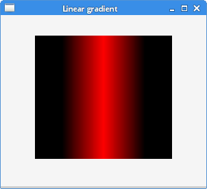

- [RadialGradientEx.java](src/com/zetcode/canvas/e48/RadialGradientEx.java)

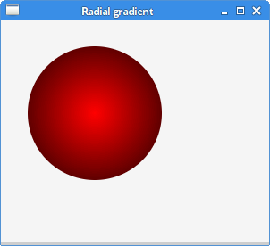

- [ShapesEx.java](src/com/zetcode/canvas/e49/ShapesEx.java)

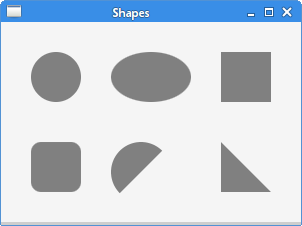

- [StarShapeEx.java](src/com/zetcode/canvas/e50/StarShapeEx.java)

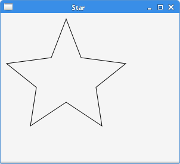

- [TransparentRectanglesEx.java](src/com/zetcode/canvas/e51/TransparentRectanglesEx.java)

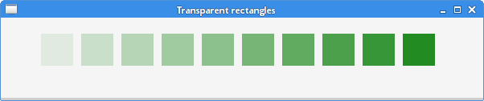

### [Charts](http://zetcode.com/gui/javafx/charts/)

- [LineChartEx.java](src/com/zetcode/charts/e52/LineChartEx.java)

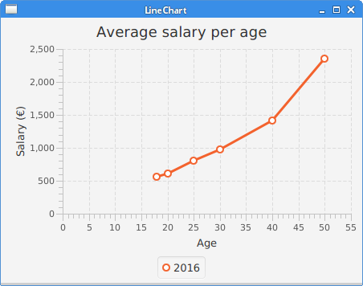

- [AreaChartEx.java](src/com/zetcode/charts/e53/AreaChartEx.java)

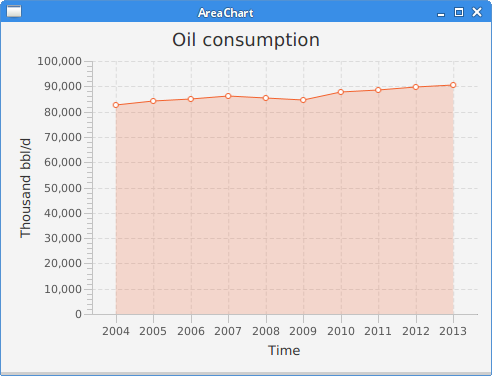

- [ScatterChartEx.java](src/com/zetcode/charts/e54/ScatterChartEx.java)

- [BarChartEx.java](src/com/zetcode/charts/e55/BarChartEx.java)

- [PieChartEx.java](src/com/zetcode/charts/e56/PieChartEx.java)

